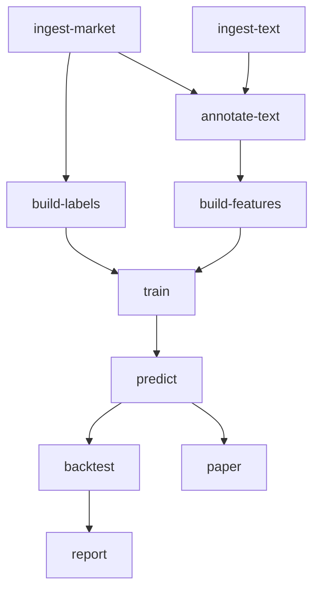

# Workflows and Commands

This page explains what each CLI command does, which prerequisites it runs, and which files it
produces.

## Three command categories

These commands do not create a research run:

| Command | Purpose |
|---|---|
| `validate-config` | Validate the typed YAML and required local paths. |
| `generate-synthetic` | Create deterministic asset, market, and text fixture files. |

Pipeline execution commands validate first, create a new immutable `run_id`, execute their dependency
graph, and write either `run.final.json` or `run.failed.json`. There is no resume-in-place behavior.

The third category is the standalone `nlp-trader broker ...` command group. It uses a separate broker
config and audit ledger, creates no research run, and is never invoked by a pipeline or paper command.
See [Broker integration](broker.md).

## Stage dependency graph



`smoke` is an alias for running through `report`. The `paper` branch is separate from `report` and
the backtest.

## Command reference

| Command | Prerequisites run in the same new run | Primary result |
|---|---|---|
| `ingest-market` | none | Bronze references and silver assets, bars, and configured optional records |
| `ingest-text` | loads/captures the filtered asset master internally | Bronze references and normalized silver text |
| `annotate-text` | market + text ingestion | Optional v2 semantic/evidence sidecars, deterministic verification, raw/provenance records, and replay-checked DecisionRounds; no output when disabled |
| `build-features` | text annotation stage | Silver text signals and gold feature table |
| `build-labels` | market ingestion | Gold label table |
| `train` | features + labels | Versioned model artifact |
| `predict` | training | Predictions and model-evaluation JSON |
| `backtest` | prediction | Separate development/final-holdout per-family replays and comparisons |
| `paper` | prediction | Latest pending simulation-only intent snapshot plus hash-chained event evidence |
| `report` | backtest | Markdown research note |
| `smoke` | same path as `report` | Smallest complete end-to-end run |

Every successful pipeline command also writes a final manifest.

## Global and shared options

Show all commands:

```bash
uv run nlp-trader --help
```

Enable debug logging by putting the global option before the command:

```bash
uv run nlp-trader --verbose backtest --config configs/sample.yaml
```

Pipeline commands and `validate-config` accept:

```text
--config FILE
--start-date ISO_DATE_OR_AWARE_TIMESTAMP
--end-date ISO_DATE_OR_AWARE_TIMESTAMP
--symbol SYMBOL          # repeatable; --symbols is an alias
--limit N
```

The overrides become part of the immutable typed config and therefore affect the config hash.

## Runtime filter semantics

### Dates

Dates bound emitted `asof_ts` decision rows. They do not simply slice every source at the same
points. For a delayed daily-bar feed, `asof_ts` can follow the official source-bar close.
The pipeline adds:

- market-session warm-up before the requested start;
- text calendar-day warm-up before the requested start;
- exact-session label bars after the requested end; and
- bounded known-event context after the final selected decision.

It builds with that context, then filters gold outputs back to the requested decision interval.

### Symbols

Symbols restrict the asset master and market universe. Raw and silver text records are not filtered
merely because their prose lacks a selected symbol; they are linked against the filtered asset
master during feature preparation. A supplied asset-ID prelink outside the filtered universe fails
validation rather than being silently removed. A symbol-only prelink does not resolve automatically;
see [Input data](input_data.md).

### Limit

`--limit N` selects the earliest `N` complete market decision timestamps after date and symbol
filters. It preserves the whole asset cross-section and required context.

The standalone `ingest-text` stage does not apply this market-decision limit to source text rows.
Use a downstream stage such as `build-features` when you want limit semantics tied to selected market
decisions.

## Recommended workflows

### Fast implementation check

```bash
uv run nlp-trader smoke --config configs/sample.yaml
```

Use this after setup and after substantive code changes. It is not a research experiment.

### Synthetic assumption comparison

```bash
uv run nlp-trader backtest --config configs/backtest.yaml
```

This still uses synthetic data, but applies a nonzero embargo and stricter cost/constraint settings
than the sample config. It is useful for regression and report inspection, not performance claims.

### Bounded local-data run

```bash
uv run nlp-trader backtest \
  --config configs/local.yaml \
  --start-date 2024-01-01 \
  --end-date 2024-06-30 \
  --symbol AAPL \
  --symbol MSFT \
  --limit 100
```

Start small, inspect the manifest and feature counts, then widen the period. Full mode currently
materializes downstream working sets in memory.

### Strict Japanese cash-equity baseline

Prepare permitted local files first; the repository includes no J-Quants payload or downloader.
The template intentionally fails path validation until those files exist:

```bash
uv run nlp-trader validate-config --config configs/japan_baseline.yaml
uv run nlp-trader ingest-market --config configs/japan_baseline.yaml
uv run nlp-trader backtest --config configs/japan_baseline.yaml --limit 320
```

The XJPX contract separates the official session-close `ts` from the exact payload's later
`available_at`, uses raw prices for hypothetical fills, and chooses the first exchange open strictly
after the safe decision timestamp. Follow [Japan cash-equity baseline](japan_baseline.md) before
normalizing an export. A completed run is a data-contract and implementation result, not evidence of
profitability.

### Generate paper intents

```bash
uv run nlp-trader paper --config configs/sample.yaml
```

The CLI paper stage:

- looks at the latest combined-model decision;
- uses the same absolute-score `models.top_k` portfolio selection as the combined-model backtest,
  including eligible shorts when explicitly enabled and available;
- emits one `BUY`, `SHORT`, or `FLAT` intent for every asset in the latest cross-section;
- applies portfolio constraints to selected target weights; and
- writes empty `positions` and `trades` with unchanged initial `equity`, plus a hash-chained
  `paper_intent_batch` evidence event.

It does not fill anything, charge costs, maintain account state, or connect to a broker. The separate
`PaperSimulator` class is an in-memory programmatic utility for simulated rebalances and
mark-to-market events from caller-supplied returns; it never invokes the standalone broker adapter
and has no price-level fill model.

### Operate the standalone kabuS adapter

```bash
uv run nlp-trader broker --help
```

Broker commands are independent from the dependency graph above and accept only the broker's strict,
operator-prepared limit-order document with an explicit expiry—not predictions, backtest trades, or
paper intents. Authenticated commands run only on the same Windows PC as kabuStation. Validation
returns fixed test responses and does not model realistic account state; production can place real
orders. Every config and environment shares fixed current-user audit, kill-switch, and operation-lock
state. Follow the preview/confirmation ceremonies, ambiguity policy, and private single-user
requirements in [Broker integration](broker.md).

### Optional local transformer sentiment

```bash
uv sync --extra nlp
uv run nlp-trader smoke \
  --config configs/sample.yaml \
  --enable-transformer-sentiment
```

Set `transformer.model_name` to a model already present locally first. Keep
`transformer.local_files_only: true` for an offline, reproducible run. Outputs are cached by normalized
text/model identity.

### Optional local generative semantic/evidence annotation

First edit a copied config: set `paths.llm_model` to an immutable local model directory, fill the
model ID/revision/license fields, and enable annotation. Keep `feature_mode: sidecar` for the first
review run:

```yaml
paths:
  llm_model: /absolute/path/to/immutable/local-model
llm_annotations:
  enabled: true
  feature_mode: sidecar
  model_id: local-model-id
  model_revision: exact-local-revision
  model_license_or_terms_ref: local-license-record
```

Then generate and inspect only the sidecars:

```bash
uv sync --extra nlp
uv run nlp-trader annotate-text --config configs/local.yaml
```

`annotate-text` runs both ingestion prerequisites. `build-features` and every downstream stage also
run it automatically because it is a dependency. With `enabled: false`, the stage is a no-op and the
deterministic sample output is unchanged. With sidecar mode above, the stage writes:

- the exact prompt, output schema, model/verifier provenance, and successful response/cache records;
- every newly generated raw attempt before parsing, so malformed output remains available in a
  failed run for diagnosis;
- verified per-entity Silver semantic/evidence rows and processing/verification summaries; and
- `models.../<run_id>/llm_decisions/rounds.jsonl`, which is immediately replayed and verified.

The DecisionRound records whether each request was newly generated, a cache hit, or deduplicated. It
also retains exact output, verifier checks, available token/latency values, and optional configured
estimated cost. This first implementation has no tool, calibration, portfolio, risk, order, or
outcome content in the round.

Cache replay reparses the stored raw generation and requires an exact match with the stored
structured payload. DecisionRound validation repeats that raw/structured binding whenever structured
output is present, including on a failed verifier result. A truncated generation cannot carry
structured output or a passing verifier result, and cache/deduplicated rounds cannot carry new
inference usage. A missing ledger path is an error; an intentionally empty enabled run still writes
and verifies an empty file.

The v2 prompt uses only the current source item, host-linked candidates, source-local numbered spans,
source type/quality, and the configured horizon. The host request contract records the safe decision
time, but the model prompt does not receive a date. It has no RAG, other-document retrieval, external
tools, model router, prices, labels, return forecasts, or order generation. The deterministic
verifier checks identity/coverage, timing, horizon, evidence references, and cited numeric tokens; it
does not prove that the prose interpretation is true.

After reviewing task-level accuracy and freezing the model, prompt, schema, verifier, decoding, and
labeled evaluation set, create a new versioned config for augmentation:

```yaml
models:
  families: [traditional, text, combined, llm, traditional_llm, all]
llm_annotations:
  enabled: true
  feature_mode: augment
  model_id: local-model-id
  model_revision: exact-local-revision
  model_license_or_terms_ref: local-license-record
```

Augmentation adds separate `llm_*` values; it never replaces conventional text sentiment or events.
Transformer sentiment may coexist. The shared cache is keyed by exact input, candidate,
model-directory, prompt/schema/verifier, and decoding identity. A complete augment backtest writes the
six family results plus `evaluation/llm_ablation_comparison.json`; its differences are arithmetic
diagnostics, not a promotion decision.

## Model selection details

`models.top_k` sets the depth of the long-side precision-at-k diagnostic and caps the candidate set
for every configured learned family and momentum backtests plus latest `combined` paper intents. In
augment mode, the family meanings are fixed: `traditional` is numeric, `text` is conventional text,
`combined` is their union, `llm` is LLM-only, `traditional_llm` is numeric plus LLM, and `all` uses all
three feature groups. The portfolio path applies direction eligibility before absolute-score ranking;
that selection is deliberately distinct from raw-score-descending precision-at-k. Exposure, turnover,
and participation constraints follow. Equal-weight and no-trade reference paths remain uncapped.

## Validation and failures

An invalid config fails before a run directory is created. A failure after run creation writes
`run.failed.json` and preserves partial artifacts for diagnosis. The failure manifest records the
exception type and message but not a traceback.

For a newly generated LLM response, the raw generation-attempt file is created before strict parsing.
A malformed response or verifier failure therefore leaves the attempt for diagnosis but does not
write a validated cache record, Silver annotation, or DecisionRound for that request.

See [Troubleshooting](troubleshooting.md) for common errors and [Outputs](outputs.md) for the artifact
layout.

Return to the [documentation home](README.md).
